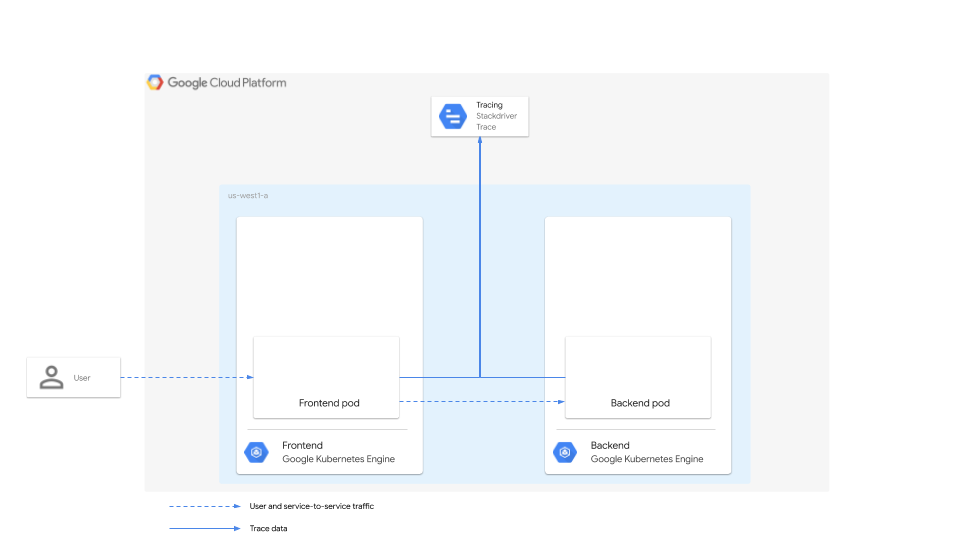
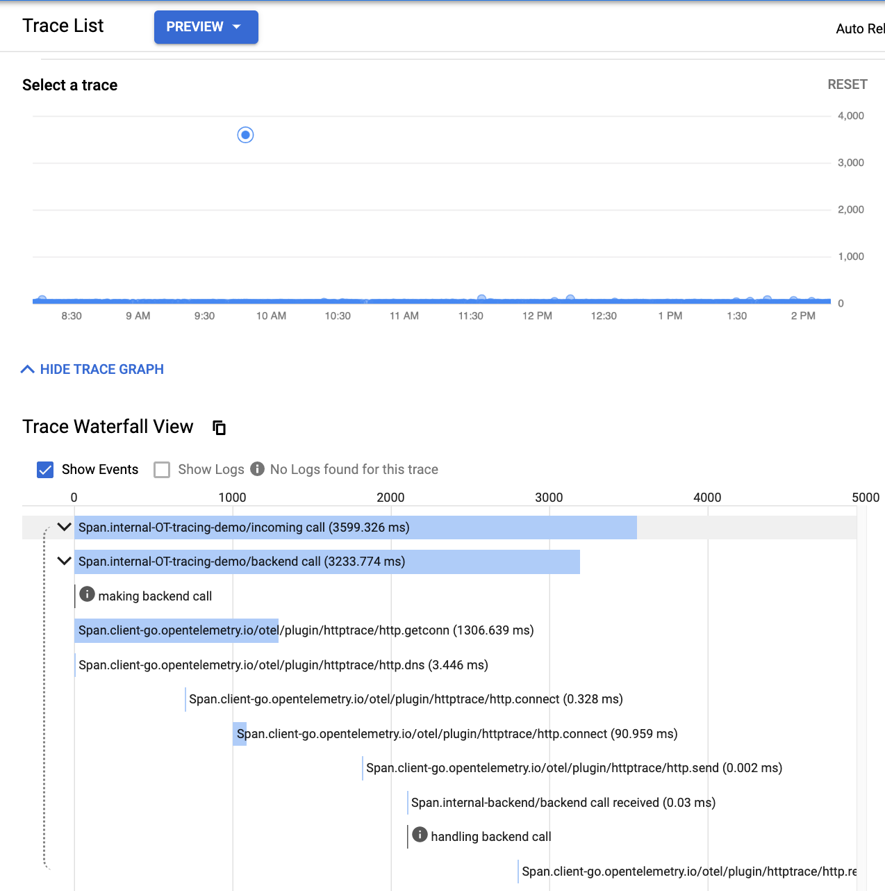

Toward the end of last year, I had the good fortune of publishing a reference [guide](https://cloud.google.com/solutions/using-distributed-tracing-to-observe-microservice-latency-with-opencensus-and-stackdriver-trace) on using OpenCensus for distributed tracing.  In it, I covered distributed tracing fundamentals, like traces, spans, and context propagation, and demonstrated using OpenCensus to instrument a simple pair of frontend/backend services written in Go.  Since then, the OpenCensus and OpenTracing projects have merged into [OpenTelemetry](https://opentelemetry.io), a "single set of APIs, libraries, agents, and collector services to capture distributed traces and metrics from your application."  I wanted to attempt to reproduce the work I did in OpenCensus using the new project and see how much has changed.

# Objective
For this exercise, I built a simple [demo](https://github.com/yuriatgoogle/stack-doctor/opentelemetry-tracing-demo).  It consists of two services. The frontend service receives an incoming request and makes a request to the backend.  The backend receives the request and returns a response.  Our objective is to trace this interaction to determine the overall response latency and understand how the two services and the nework connectivity between them contribute to the overall latency.



In the original guide, the two services were deployed in two separate GKE clusters, but that is actually not necessary to demonstrate distributed tracing.  For this exercise, we'll simply run both services locally.

# Primitives
While the basic concepts are covered in the reference guide and in much greater detail in the Google Dapper research [paper](https://research.google.com/archive/papers/dapper-2010-1.pdf), it's still worth briefly covering them here such that we can then understand how they're implemented in the code.  

From the reference guide:

>A _trace_ is the total of information that describes how a distributed system responds to a user request. Traces are composed of _spans_, where each span represents a specific request and response pair involved in serving the user request. The _parent_ span describes the latency as observed by the end user. Each of the _child_ spans describes how a particular service in the distributed system was called and responded to, with latency information captured for each.

This is well illustrated in the aforementioned research paper using this diagram:


# Implementation
Let's take a look at how we can implement distributed tracing in our frontend/backend service pair using OpenTelemetry. Note that most of this is adopted from the [samples](https://github.com/open-telemetry/opentelemetry-go/tree/master/example) published by OpenTelemetry in their Github [repo](https://github.com/open-telemetry/opentelemetry-go). I made relatively minor changes to add custom spans and use the Mux router, rather than just basic HTTP handling. 

## Frontend code
We'll start by reviewing the frontend [code](https://github.com/yuriatgoogle/stack-doctor/blob/master/opentelemetry-tracing-demo/go/frontend/frontend.go).  

### Imports
First, the imports:

```go
import (
	"fmt"
	"log"
	"net/http"
	"os"
	"context"
	"io/ioutil"
	"google.golang.org/grpc/codes"

	"github.com/gorilla/mux"

	"go.opentelemetry.io/otel/api/distributedcontext"
	"go.opentelemetry.io/otel/api/global"
	"go.opentelemetry.io/otel/api/trace"
	"go.opentelemetry.io/otel/exporter/trace/stackdriver"
	"go.opentelemetry.io/otel/plugin/httptrace"
	sdktrace "go.opentelemetry.io/otel/sdk/trace"
)
```
Mostly, we're using a variety of OpenTelemetry libraries at this point.  We'll also use the [Mux](https://github.com/gorilla/mux) router to handle HTTP requests (I mostly use it because it seem to be similar to Express in Node.js).  


### Main function
Next, let's have a look at the `main()` function for our service:

```go
func main() {
	initTracer()

	r := mux.NewRouter()
	r.HandleFunc("/", mainHandler)
	
	if (env=="LOCAL") {
		http.ListenAndServe("localhost:8080", r)
	} else {
		http.ListenAndServe(":8080", r)
	}
}
```

As you can tell, this is pretty straighforward.  We initialize tracing right at the start and use a Mux router to handle a single route for requests to `/`.  We then start the server on port 8080.  I added an environment variable to check to see whether I'm running the code locally to bypass the MacOS prompt to allow inbound network connections as per these [instructions](https://medium.com/@leeprovoost/suppressing-accept-incoming-network-connections-warnings-on-osx-7665b33927ca).

### Initialize tracing
Next, let's take a look at the `initTracer()` function:

```go
func initTracer() {

	// Create Stackdriver exporter to be able to retrieve
	// the collected spans.
	exporter, err := stackdriver.NewExporter(
		stackdriver.WithProjectID(projectID),
	)
	if err != nil {
		log.Fatal(err)
	}

	// For the demonstration, use sdktrace.AlwaysSample sampler to sample all traces.
	// In a production application, use sdktrace.ProbabilitySampler with a desired probability.
	tp, err := sdktrace.NewProvider(sdktrace.WithConfig(sdktrace.Config{DefaultSampler: sdktrace.AlwaysSample()}),
		sdktrace.WithSyncer(exporter))
	if err != nil {
		log.Fatal(err)
	}
	global.SetTraceProvider(tp)
}
```

Here, we're simply instantiating the Stackdriver exporter and settting the sampling parameter to capture every trace.  

### Handle requests

Finally, let's look at the `mainHandler()` function that is called to handle requests to `/`. 

```go
func mainHandler(w http.ResponseWriter, r *http.Request) {
	
	tr := global.TraceProvider().Tracer("OT-tracing-demo")

	client := http.DefaultClient
	ctx := distributedcontext.NewContext(context.Background())
	
	var body []byte

	err := tr.WithSpan(ctx, "incoming call",  // root span here
		func(ctx context.Context) error {
			
			// create child span
			ctx, childSpan := tr.Start(ctx, "backend call")
			childSpan.AddEvent (ctx, "making backend call")

			// create backend request
			req, _ := http.NewRequest("GET", backendAddr, nil)

			// inject context
			ctx, req = httptrace.W3C(ctx, req)
			httptrace.Inject(ctx, req)

			// do request
			log.Printf("Sending request...\n")
			res, err := client.Do(req)
			if err != nil {
				panic(err)
			}
			body, err = ioutil.ReadAll(res.Body)
			_ = res.Body.Close()

			// close child span
			childSpan.End()

			trace.SpanFromContext(ctx).SetStatus(codes.OK)
			log.Printf("got response: %d\n", res.Status)
			fmt.Printf("%v\n", "OK") //change to status code from backend
			return err
		})

	if err != nil {
		panic(err)
	}	
}
```

Here, we're setting the name of the tracer to "OT-tracing-demo" and starting a root span labeled "incoming call".  We then create a child span of that labeled "backend call" and pass the context to it.  We then create a request to our backend server, whose location is defined in an env variable and inject our context into that request - we'll see how that context is used in the backend in a bit.  Finally, we make the request, get the status code, and output a confirmation message.  Pretty straightforward! 

A couple of things to note further:
* I am explicitly closing the child span, rather than using `defer` for more control over exactly when the timer is stopped. 
* I am adding events to spans for even more clear labeling.

Now, let's look at our [backend](https://github.com/yuriatgoogle/stack-doctor/blob/master/opentelemetry-tracing-demo/go/backend/backend.go).

## Backend code
Much of the code here is very similar to the frontend - we use the same exact `main()` and `initTracer()` functions to run the server and initialize tracing.  

### mainHandler
```go
func mainHandler(w http.ResponseWriter, req *http.Request) {
    // start tracer
    tr := global.TraceProvider().Tracer("backend")
    // get context from incoming request
    attrs, entries, spanCtx := httptrace.Extract(req.Context(), req)

    // create request using context
    req = req.WithContext(distributedcontext.WithMap(req.Context(), distributedcontext.NewMap(distributedcontext.MapUpdate{
        MultiKV: entries,
    })))

    // create span
    ctx, span := tr.Start(
        req.Context(),
        "backend call received",
        trace.WithAttributes(attrs...),
        trace.ChildOf(spanCtx),
    )

    span.AddEvent(ctx, "handling backend call")

    // output
    log.Printf("backend call received")
    fmt.Printf("OK")
    // close span
    span.End()
}
```

The `mainHandler()` function does look quite different.  Here, we extract the span context from the incoming request, create a new request object using that context, and create a new span using that request context.  We also add an event to our span for explicit labeling.  Finally, we return "OK" to the caller and close our span.  Again, I could have used `defer span.End()` instead of doing it explicitly.  

>**Note** the difference between span context and request context.  This is specifically relevant when accepting incoming context and using it to create child spans.  For further exploration of these two, take a look at the relevant [documentation](https://opentracing.io/docs/best-practices/) from OpenTracing.

# Traces
Now that we've seen how to implement tracing instrumentation in our code, let's take a look at what this instrumentation creates.  We can run both frontend and backend locally after setting the relevant environment variables for each and using `gcloud auth login` to log in to Google Cloud.  Once we do that, we can hit the frontend on http://localhost:8080 and issue a few requests.  This should immediately result in traces being written to Stackdriver:



You can see the span names we specified in our code and the events we added for clearer labeling.  One additional thing I was pleasantly surprised by is that OpenTelemetry explicitly adds steps for the HTTP/networking stack, including DNS, connecting, and sending and receiving data.  

# Conclusion
I greatly enjoyed attempting to reproduce the work I did in OpenCensus with OpenTelemetry and eventually found it understandable and clear, especially once I was pointed to the tracer.Start() method to create child spans.  Come back next time when I attempt to use the stats features of OpenTelemetry to create custom metrics.  Until then!